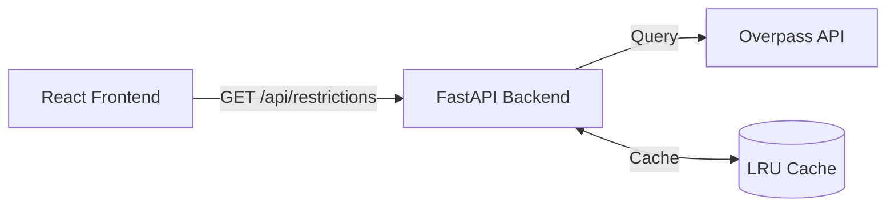
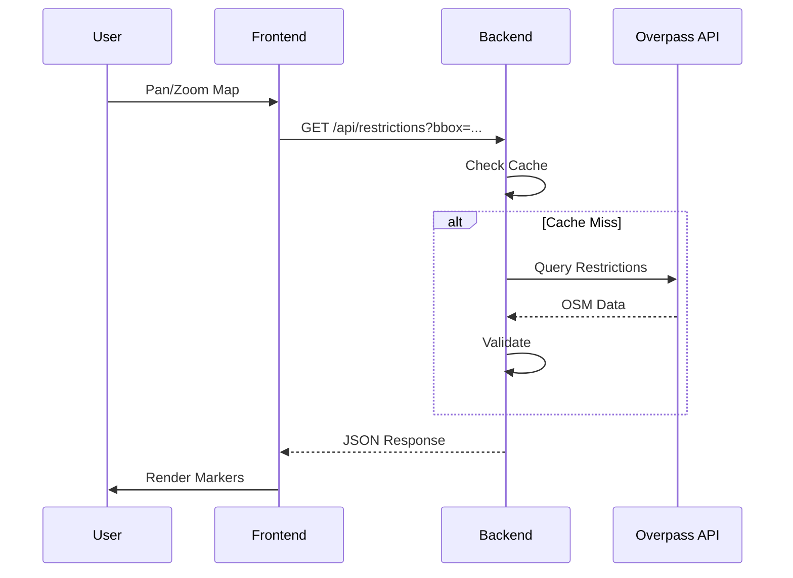

# Turn Restriction Validator

Validates OSM turn restrictions and highlights errors/warnings on an interactive map.


## Quick Start

```bash
# Using Docker (recommended)
docker compose up

# Access at http://localhost:8080
```

## Features

- Interactive Leaflet map with marker clustering
- Validates turn restrictions (missing members, wrong types, invalid tags)
- Filter by status (OK/Warning/Error) and restriction type
- Direct links to edit in HudHud OSM or JOSM
- Built-in caching and rate limiting

## Architecture



## Data Flow



## API

```bash
# Get restrictions in bounding box
curl "http://localhost:8080/api/restrictions?bbox=minLon,minLat,maxLon,maxLat"

# Health check
curl "http://localhost:8080/api/health"
```

## Environment Variables

| Variable | Default | Description |
|----------|---------|-------------|
| `OVERPASS_URL` | `https://overpass-api.hudhud.cloud/api/interpreter` | Overpass endpoint |
| `CACHE_TTL_SECONDS` | `300` | Cache TTL |
| `RATE_LIMIT_RPM` | `60` | Rate limit per IP |
| `MAX_BBOX_AREA` | `2000` | Max bbox area (sq degrees) |

## Validation Rules

**Errors:**
- `missing_from_member` / `missing_to_member` / `missing_via_member`
- `invalid_from_type` / `invalid_to_type` / `invalid_via_type`
- `missing_restriction_tag`

**Warnings:**
- `unrecognized_restriction_type`
- `nonexistent_member`
- `oneway_inconsistency`

## Adding Rules

```python
# backend/app/validation/rules/my_rules.py
from app.validation.models import Issue, IssueSeverity
from app.validation.rules.base import ValidationRule

class MyRule(ValidationRule):
    @property
    def code(self) -> str:
        return "my_rule"

    def check(self, relation, elements_by_id) -> list[Issue]:
        # Your logic here
        return []
```

Register in `backend/app/validation/rules/__init__.py`.

## Development

```bash
# Backend
cd backend && pip install -r requirements.txt
uvicorn app.main:app --reload --port 8080

# Frontend
cd frontend && npm install && npm run dev
```
